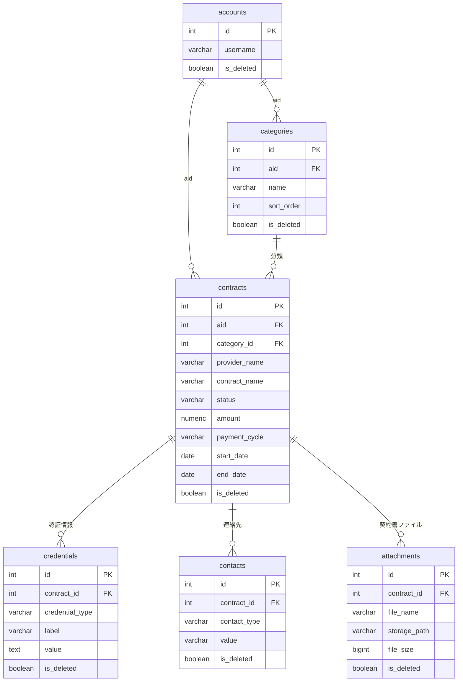

# 契約管理 DB 設計仕様書

## 概要

日々の生活で契約しているサービス（携帯電話・電気・ガス・保険・インターネット・動画配信など）を、ユーザーごとに一元管理するための PostgreSQL スキーマ設計。

| 項目 | 内容 |
|------|------|
| DBMS | PostgreSQL |
| スキーマ名 | `contract` |
| ユーザー識別子 | `aid` (INT) — `public.accounts.id` を外部参照。ユーザー単位のデータ分離に使用 |
| 文字コード | UTF-8 |

### 設計方針

1. **ユーザー分離**: すべてのテーブルに `aid` を持たせ、バックエンドで `aid` によるフィルタを必須とする。
2. **契約を中心とした構成**: 契約（`contracts`）を親とし、認証情報・連絡先・契約書ファイルを子テーブルで管理する。
3. **カテゴリはユーザー登録のみ**: システム共通カテゴリは設けず、ユーザーが自由に登録・管理する。
4. **支払いは契約に内包**: 1 契約につき 1 つの支払い情報を `contracts` テーブルに直接保持する。
5. **機密情報**: パスワード等は `TEXT` 型の通常カラムに格納する。暗号化はアプリケーション層の責務とし、DB 側では特別な型や暗号化機能は使わない。
6. **ユーザー外部参照**: `aid` は既存の `public.accounts` テーブルの `id` を参照する。
7. **論理削除**: すべてのテーブルに `is_deleted` フラグを持たせ、物理削除は行わない。`public.accounts` と同じ方式とする。

---

## 外部参照: `public.accounts`

`contract` スキーマ内の `aid` は、既存ユーザー管理テーブル `public.accounts` の主キー `id` を指す。

### `public.accounts`（参照元・本仕様では作成しない）

| カラム名 | 型 | NULL | 説明 |
|----------|-----|------|------|
| `id` | `INTEGER` | NOT NULL | **PK** — `contract` スキーマの `aid` が参照する |
| `username` | `VARCHAR` | NOT NULL | ユーザー名 |
| `password` | `VARCHAR` | NOT NULL | パスワード |
| `session_info` | `TEXT` | NULL 可 | セッション情報 |
| `last_access` | `TIMESTAMP` | NOT NULL | 最終アクセス日時 |
| `is_deleted` | `BOOLEAN` | NOT NULL | 削除フラグ（論理削除） |
| `created_at` | `TIMESTAMP` | NOT NULL | 作成日時 |
| `updated_at` | `TIMESTAMP` | NOT NULL | 更新日時 |
| `random_number` | `INTEGER` | NULL 可 | — |
| `email` | `TEXT` | NULL 可 | メールアドレス |

### `aid` の外部キー定義

`aid` を持つテーブル（`categories`, `contracts`）では、以下の外部キー制約を設ける。

| 制約名（推奨） | 定義 |
|---------------|------|
| `categories_aid_fkey` | `aid` REFERENCES `public.accounts(id)` |
| `contracts_aid_fkey` | `aid` REFERENCES `public.accounts(id)` |

**削除時の挙動**: `ON DELETE RESTRICT`（アカウント削除時に契約データが残っていれば削除不可）

> `accounts.is_deleted` による論理削除を採用しているため、物理削除は通常発生しない。バックエンドは認証時に `is_deleted = false` のアカウントのみ有効とする。

---

## ER 図



---

## テーブル一覧

| # | テーブル名 | 論理名 | 説明 |
|---|-----------|--------|------|
| 1 | `contract.categories` | 契約カテゴリ | ユーザーが自由に登録する分類 |
| 2 | `contract.contracts` | 契約 | 契約本体・支払い情報 |
| 3 | `contract.credentials` | 認証情報 | ログイン ID・パスワード等 |
| 4 | `contract.contacts` | 連絡先 | 問い合わせ先・サポート URL 等 |
| 5 | `contract.attachments` | 契約書ファイル | 契約書 PDF 等のファイル参照 |

---

## 共通カラム定義

以下のカラムは複数テーブルで共通利用する。

| カラム名 | 型 | 制約 | 説明 |
|----------|-----|------|------|
| `aid` | `INT` | `NOT NULL`, **FK** → `public.accounts(id)` | ユーザー ID（`categories`, `contracts` で使用） |
| `is_deleted` | `BOOLEAN` | `NOT NULL DEFAULT FALSE` | 論理削除フラグ（`TRUE` = 削除済み） |
| `created_at` | `TIMESTAMPTZ` | `NOT NULL DEFAULT NOW()` | 作成日時 |
| `updated_at` | `TIMESTAMPTZ` | `NOT NULL DEFAULT NOW()` | 更新日時 |

> `updated_at` はアプリケーションまたは DB トリガーで更新する。

---

## 論理削除

`public.accounts` と同様に、すべてのテーブルで物理削除は行わず、`is_deleted` フラグによる論理削除とする。

### 削除操作

| 操作 | 実装 |
|------|------|
| DELETE（API） | `UPDATE ... SET is_deleted = TRUE, updated_at = NOW()` |
| 物理 DELETE | 通常運用では行わない |

### カスケード削除（論理）

親レコードを論理削除する際、紐づく子レコードも同時に論理削除する（アプリケーション層で実施）。

| 親 | 子（同時に `is_deleted = TRUE`） |
|----|--------------------------------|
| `contracts` | `credentials`, `contacts`, `attachments` |

### 参照整合性

| ケース | ルール |
|--------|--------|
| カテゴリ削除 | 未削除の契約（`contracts.is_deleted = FALSE`）が紐づいている場合は削除不可 |
| 外部キー | 子テーブルの FK は `ON DELETE RESTRICT`（物理削除を防止） |

### UNIQUE 制約と論理削除

論理削除後に同名カテゴリを再登録できるよう、`categories` の `(aid, name)` UNIQUE は**部分 UNIQUE インデックス**とする。

```sql
CREATE UNIQUE INDEX categories_aid_name_unique
    ON contract.categories (aid, name)
    WHERE is_deleted = FALSE;
```

### 取得時のフィルタ

通常の SELECT では `is_deleted = FALSE` を必須とする。削除済みデータの参照が必要な場合（管理画面等）のみ、明示的に `is_deleted = TRUE` を含めて取得する。

---

## テーブル詳細

### 1. `contract.categories`（契約カテゴリ）

ユーザーが自由に登録する契約の種別。システム共通カテゴリは設けない。

| カラム名 | 型 | NULL | デフォルト | 制約・説明 |
|----------|-----|------|-----------|-----------|
| `id` | `SERIAL` | NOT NULL | — | **PK** |
| `aid` | `INT` | NOT NULL | — | **FK** → `public.accounts(id)` |
| `name` | `VARCHAR(100)` | NOT NULL | — | カテゴリ名（例: 携帯電話、電気、ガス） |
| `icon` | `VARCHAR(50)` | NULL 可 | — | UI 表示用アイコン識別子（任意） |
| `sort_order` | `INT` | NOT NULL | `0` | 表示順（昇順） |
| `is_deleted` | `BOOLEAN` | NOT NULL | `FALSE` | 論理削除フラグ |
| `created_at` | `TIMESTAMPTZ` | NOT NULL | `NOW()` | 作成日時 |
| `updated_at` | `TIMESTAMPTZ` | NOT NULL | `NOW()` | 更新日時 |

**制約**

| 制約名（推奨） | 種別 | 定義 |
|---------------|------|------|
| `categories_pkey` | PRIMARY KEY | `(id)` |
| `categories_aid_fkey` | FOREIGN KEY | `aid` REFERENCES `public.accounts(id)` |

**推奨インデックス**

| インデックス名（推奨） | カラム | 用途 |
|----------------------|--------|------|
| `categories_aid_name_unique` | `(aid, name) WHERE is_deleted = FALSE` | 未削除カテゴリの名前重複防止（部分 UNIQUE） |
| `idx_categories_aid` | `(aid) WHERE is_deleted = FALSE` | ユーザー別カテゴリ取得 |
| `idx_categories_aid_sort_order` | `(aid, sort_order) WHERE is_deleted = FALSE` | 表示順ソート |

---

### 2. `contract.contracts`（契約）

契約の本体。会社名・プラン名・契約期間・状態に加え、支払い情報（1 契約 1 件）も保持する。

| カラム名 | 型 | NULL | デフォルト | 制約・説明 |
|----------|-----|------|-----------|-----------|
| `id` | `SERIAL` | NOT NULL | — | **PK** |
| `aid` | `INT` | NOT NULL | — | **FK** → `public.accounts(id)` |
| `category_id` | `INT` | NOT NULL | — | **FK** → `contract.categories(id)` |
| `provider_name` | `VARCHAR(200)` | NOT NULL | — | 会社名・事業者名（例: 東京電力、NTTドコモ） |
| `contract_name` | `VARCHAR(200)` | NULL 可 | — | プラン名・契約名（例: ファミリープラン） |
| `contract_number` | `VARCHAR(100)` | NULL 可 | — | 契約番号・お客様番号 |
| `status` | `VARCHAR(20)` | NOT NULL | `'active'` | 契約状態（後述 CHECK） |
| `start_date` | `DATE` | NULL 可 | — | 契約開始日 |
| `end_date` | `DATE` | NULL 可 | — | 契約終了日（解約済みの場合など） |
| `renewal_date` | `DATE` | NULL 可 | — | 次回更新日・契約更新日 |
| `auto_renewal` | `BOOLEAN` | NOT NULL | `TRUE` | 自動更新の有無 |
| `amount` | `NUMERIC(12, 2)` | NULL 可 | — | 支払い金額 |
| `currency` | `CHAR(3)` | NOT NULL | `'JPY'` | 通貨コード（ISO 4217） |
| `payment_cycle` | `VARCHAR(20)` | NULL 可 | — | 支払い周期（後述 CHECK） |
| `payment_day` | `SMALLINT` | NULL 可 | — | 支払日・引落日（1〜31） |
| `payment_method` | `VARCHAR(50)` | NULL 可 | — | 支払い方法（例: クレジットカード、口座振替、請求書） |
| `is_tax_included` | `BOOLEAN` | NOT NULL | `TRUE` | 税込みかどうか |
| `payment_notes` | `TEXT` | NULL 可 | — | 支払いに関する備考 |
| `notes` | `TEXT` | NULL 可 | — | 自由メモ |
| `is_deleted` | `BOOLEAN` | NOT NULL | `FALSE` | 論理削除フラグ |
| `created_at` | `TIMESTAMPTZ` | NOT NULL | `NOW()` | 作成日時 |
| `updated_at` | `TIMESTAMPTZ` | NOT NULL | `NOW()` | 更新日時 |

**`status` の CHECK 制約**

```sql
CHECK (status IN ('active', 'suspended', 'cancelled', 'pending'))
```

| 値 | 意味 |
|----|------|
| `active` | 契約中 |
| `suspended` | 一時停止 |
| `cancelled` | 解約済み |
| `pending` | 手続き中・開始前 |

**`payment_cycle` の CHECK 制約**

```sql
CHECK (payment_cycle IS NULL OR payment_cycle IN (
  'monthly', 'yearly', 'quarterly', 'biannual', 'one_time', 'other'
))
```

| 値 | 意味 |
|----|------|
| `monthly` | 月額 |
| `yearly` | 年額 |
| `quarterly` | 四半期 |
| `biannual` | 半年 |
| `one_time` | 一括 |
| `other` | その他 |

**制約**

| 制約名（推奨） | 種別 | 定義 |
|---------------|------|------|
| `contracts_pkey` | PRIMARY KEY | `(id)` |
| `contracts_aid_fkey` | FOREIGN KEY | `aid` REFERENCES `public.accounts(id)` |
| `contracts_category_id_fkey` | FOREIGN KEY | `category_id` REFERENCES `contract.categories(id)` |
| `contracts_status_check` | CHECK | `status IN ('active', 'suspended', 'cancelled', 'pending')` |
| `contracts_payment_cycle_check` | CHECK | 上記 `payment_cycle` 値 |
| `contracts_date_check` | CHECK | `end_date IS NULL OR start_date IS NULL OR end_date >= start_date` |
| `contracts_payment_day_check` | CHECK | `payment_day IS NULL OR (payment_day BETWEEN 1 AND 31)` |
| `contracts_amount_check` | CHECK | `amount IS NULL OR amount >= 0` |

**推奨インデックス**

| インデックス名（推奨） | カラム | 用途 |
|----------------------|--------|------|
| `idx_contracts_aid` | `(aid) WHERE is_deleted = FALSE` | ユーザー別契約一覧 |
| `idx_contracts_aid_status` | `(aid, status) WHERE is_deleted = FALSE` | 状態別フィルタ |
| `idx_contracts_aid_category_id` | `(aid, category_id) WHERE is_deleted = FALSE` | カテゴリ別一覧 |
| `idx_contracts_provider_name` | `(aid, provider_name) WHERE is_deleted = FALSE` | 会社名検索 |

---

### 3. `contract.credentials`（認証情報）

ログイン ID・パスワード・暗証番号など、契約に紐づく認証情報。

| カラム名 | 型 | NULL | デフォルト | 制約・説明 |
|----------|-----|------|-----------|-----------|
| `id` | `SERIAL` | NOT NULL | — | **PK** |
| `contract_id` | `INT` | NOT NULL | — | **FK** → `contract.contracts(id)` |
| `credential_type` | `VARCHAR(30)` | NOT NULL | — | 種別（後述 CHECK） |
| `label` | `VARCHAR(100)` | NULL 可 | — | 表示ラベル（例: マイページログイン） |
| `value` | `TEXT` | NOT NULL | — | 値（`TEXT` 型の通常カラム。暗号化はアプリ層で実施） |
| `url` | `VARCHAR(500)` | NULL 可 | — | ログイン URL・管理画面 URL |
| `notes` | `TEXT` | NULL 可 | — | 備考 |
| `sort_order` | `INT` | NOT NULL | `0` | 表示順 |
| `is_deleted` | `BOOLEAN` | NOT NULL | `FALSE` | 論理削除フラグ |
| `created_at` | `TIMESTAMPTZ` | NOT NULL | `NOW()` | 作成日時 |
| `updated_at` | `TIMESTAMPTZ` | NOT NULL | `NOW()` | 更新日時 |

**`credential_type` の CHECK 制約**

```sql
CHECK (credential_type IN (
  'login_id', 'password', 'pin', 'customer_number',
  'email', 'phone', 'api_key', 'other'
))
```

| 値 | 意味 |
|----|------|
| `login_id` | ログイン ID・ユーザー名 |
| `password` | パスワード |
| `pin` | 暗証番号 |
| `customer_number` | お客様番号・会員番号 |
| `email` | メールアドレス |
| `phone` | 電話番号（認証用） |
| `api_key` | API キー |
| `other` | その他 |

**制約**

| 制約名（推奨） | 種別 | 定義 |
|---------------|------|------|
| `credentials_pkey` | PRIMARY KEY | `(id)` |
| `credentials_contract_id_fkey` | FOREIGN KEY | `contract_id` REFERENCES `contract.contracts(id)` |
| `credentials_credential_type_check` | CHECK | 上記 `credential_type` 値 |

**推奨インデックス**

| インデックス名（推奨） | カラム | 用途 |
|----------------------|--------|------|
| `idx_credentials_contract_id` | `(contract_id) WHERE is_deleted = FALSE` | 契約に紐づく認証情報取得 |

---

### 4. `contract.contacts`（連絡先）

問い合わせ先電話番号・メール・サポート URL など。

| カラム名 | 型 | NULL | デフォルト | 制約・説明 |
|----------|-----|------|-----------|-----------|
| `id` | `SERIAL` | NOT NULL | — | **PK** |
| `contract_id` | `INT` | NOT NULL | — | **FK** → `contract.contracts(id)` |
| `contact_type` | `VARCHAR(20)` | NOT NULL | — | 種別（後述 CHECK） |
| `label` | `VARCHAR(100)` | NULL 可 | — | 表示ラベル（例: カスタマーセンター） |
| `value` | `VARCHAR(500)` | NOT NULL | — | 連絡先の値 |
| `notes` | `TEXT` | NULL 可 | — | 備考（受付時間など） |
| `sort_order` | `INT` | NOT NULL | `0` | 表示順 |
| `is_deleted` | `BOOLEAN` | NOT NULL | `FALSE` | 論理削除フラグ |
| `created_at` | `TIMESTAMPTZ` | NOT NULL | `NOW()` | 作成日時 |
| `updated_at` | `TIMESTAMPTZ` | NOT NULL | `NOW()` | 更新日時 |

**`contact_type` の CHECK 制約**

```sql
CHECK (contact_type IN ('phone', 'email', 'url', 'address', 'other'))
```

**制約**

| 制約名（推奨） | 種別 | 定義 |
|---------------|------|------|
| `contacts_pkey` | PRIMARY KEY | `(id)` |
| `contacts_contract_id_fkey` | FOREIGN KEY | `contract_id` REFERENCES `contract.contracts(id)` |
| `contacts_contact_type_check` | CHECK | 上記 `contact_type` 値 |

**推奨インデックス**

| インデックス名（推奨） | カラム | 用途 |
|----------------------|--------|------|
| `idx_contacts_contract_id` | `(contract_id) WHERE is_deleted = FALSE` | 契約に紐づく連絡先取得 |

---

### 5. `contract.attachments`（契約書ファイル）

契約書 PDF 等のファイル参照情報。実ファイルはストレージ（ローカルまたはオブジェクトストレージ）に保存し、DB にはメタデータのみ保持する。

| カラム名 | 型 | NULL | デフォルト | 制約・説明 |
|----------|-----|------|-----------|-----------|
| `id` | `SERIAL` | NOT NULL | — | **PK** |
| `contract_id` | `INT` | NOT NULL | — | **FK** → `contract.contracts(id)` |
| `file_name` | `VARCHAR(255)` | NOT NULL | — | 元のファイル名（表示用） |
| `storage_path` | `VARCHAR(500)` | NOT NULL | — | ストレージ上の保存パス（アプリが解決） |
| `content_type` | `VARCHAR(100)` | NULL 可 | — | MIME タイプ（例: `application/pdf`） |
| `file_size` | `BIGINT` | NOT NULL | — | ファイルサイズ（バイト） |
| `description` | `VARCHAR(200)` | NULL 可 | — | ファイルの説明（例: 契約書 2024 年版） |
| `sort_order` | `INT` | NOT NULL | `0` | 表示順 |
| `is_deleted` | `BOOLEAN` | NOT NULL | `FALSE` | 論理削除フラグ |
| `created_at` | `TIMESTAMPTZ` | NOT NULL | `NOW()` | 作成日時 |
| `updated_at` | `TIMESTAMPTZ` | NOT NULL | `NOW()` | 更新日時 |

**制約**

| 制約名（推奨） | 種別 | 定義 |
|---------------|------|------|
| `attachments_pkey` | PRIMARY KEY | `(id)` |
| `attachments_contract_id_fkey` | FOREIGN KEY | `contract_id` REFERENCES `contract.contracts(id)` |
| `attachments_file_size_check` | CHECK | `file_size > 0` |

**推奨インデックス**

| インデックス名（推奨） | カラム | 用途 |
|----------------------|--------|------|
| `idx_attachments_contract_id` | `(contract_id) WHERE is_deleted = FALSE` | 契約に紐づくファイル一覧取得 |

**ファイル保存に関する補足**

- `storage_path` の形式はアプリケーション側で統一する（例: `{aid}/{contract_id}/{uuid}_{file_name}`）。
- 契約の論理削除時、子レコード（`credentials`, `contacts`, `attachments`）も同時に論理削除する。
- ストレージ上の実ファイルは論理削除時に削除しても残してもよいが、方針はアプリケーション側で統一する（推奨: 論理削除時はファイルは残し、一定期間後に物理削除）。

---

## リレーション概要

```
public.accounts      (1) ──< (N) contract.categories
public.accounts      (1) ──< (N) contract.contracts
contract.categories  (1) ──< (N) contract.contracts
contract.contracts   (1) ──< (N) contract.credentials
contract.contracts   (1) ──< (N) contract.contacts
contract.contracts   (1) ──< (N) contract.attachments
```

- `aid` は `public.accounts.id` への外部キー（`ON DELETE RESTRICT`）。
- すべてのテーブルは **論理削除**（`is_deleted = TRUE`）。物理 DELETE は行わない。
- 契約の論理削除時、子テーブル（`credentials`, `contacts`, `attachments`）も **連鎖論理削除**する。
- カテゴリの論理削除時、未削除の契約が紐づいている場合は削除不可。
- カテゴリはユーザー（`aid`）に紐づく。契約の `category_id` は同一ユーザーのカテゴリのみ参照可能とする（アプリ層で検証）。

---

## `aid` によるデータアクセスルール

`aid` は認証済みユーザーの `public.accounts.id` と一致する値を使用する。バックエンド実装時に必ず守ること。

| 操作 | ルール |
|------|--------|
| SELECT | `WHERE aid = :current_aid AND is_deleted = FALSE` を必須 |
| INSERT | `aid` に認証済みユーザーの `public.accounts.id` をセット。`is_deleted = FALSE`（クライアントからの `aid` は無視） |
| UPDATE | 対象レコードの `aid` が認証済みユーザーの `aid` と一致し、`is_deleted = FALSE` であること |
| DELETE | 物理削除は行わず `UPDATE SET is_deleted = TRUE` で論理削除する |

子テーブル（`credentials`, `contacts`, `attachments`）は `contract_id` 経由で親契約の `aid` を検証してから操作する。カテゴリ参照時は `categories.aid = contracts.aid` を確認する。認証時は `accounts.is_deleted = FALSE` のアカウントのみ有効とする。

---

## ビュー（任意・推奨）

月額合計などの集計を簡略化するためのビュー例。

### `contract.v_monthly_cost_summary`

ユーザーごとの月額換算支払い合計（アクティブ契約のみ）。

```sql
-- 参考 SQL（実装時に調整可）
CREATE VIEW contract.v_monthly_cost_summary AS
SELECT
    c.aid,
    c.id AS contract_id,
    c.provider_name,
    c.contract_name,
    CASE c.payment_cycle
        WHEN 'monthly'   THEN c.amount
        WHEN 'yearly'    THEN c.amount / 12
        WHEN 'quarterly' THEN c.amount / 3
        WHEN 'biannual'  THEN c.amount / 6
        ELSE 0
    END AS monthly_amount
FROM contract.contracts c
WHERE c.status = 'active'
  AND c.is_deleted = FALSE
  AND c.amount IS NOT NULL
  AND c.payment_cycle IS NOT NULL;
```

---

## 将来拡張の余地（今回は未実装）

以下は必要になったタイミングで追加を検討する。

| テーブル案 | 用途 |
|-----------|------|
| `contract.tags` / `contract_contract_tags` | 自由なタグ付け |
| `contract.custom_fields` | カテゴリごとの追加項目 |

---

## 命名規則

| 対象 | 規則 |
|------|------|
| スキーマ | `contract` |
| テーブル | 英語複数形・スネークケース（`contracts`, `attachments`） |
| 主キー | `id`（`SERIAL`） |
| 外部キー | `{参照先単数}_id`（例: `contract_id`, `category_id`） |
| 制約名 | `{テーブル名}_{説明}_{種別}`（例: `contracts_status_check`） |
| インデックス名 | `idx_{テーブル名}_{カラム名}` |
